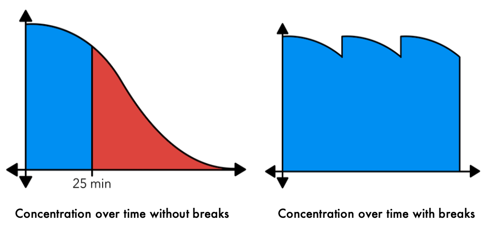
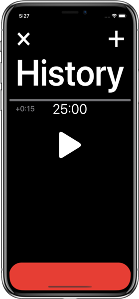
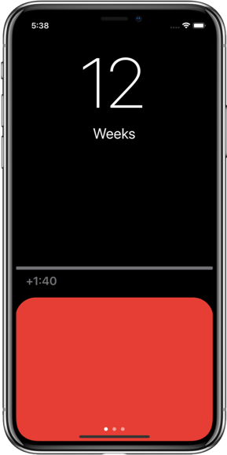

Studying and staying motivated weren't easy before, and now it is harder than ever with
all the distractions of the home. Therefore, I thought I would walk you through some
study advice that I have learned, and then built into my app
[StudyStreaks](https://apps.apple.com/au/app/studystreaks/id1478096728).

This article was originally published in
[Lot's Wife Magazine](https://lotswife.com.au/study-advice-from-a-jaffy/).

## When to Take Breaks
According to the [New York Times](https://www.nytimes.com/2012/06/17/jobs/take-breaks-regularly-to-stay-on-schedule-workstation.html?emc=eta1),
the average person can study for about 25 minutes before losing focus, but fortunately,
it only takes about five minutes to reset that concentration.

In StudyStreaks, the timer will count down to each break, and then count down the break to figure this out for you:

## How to Motivate Yourself
The human brain is naturally loss averse, that is, we hate to lose progress, especially when it took
hard work to get there. You can take advantage of this by setting up a streak for your studies. Every
week you reach your study goal, you add one to your streak counter. If you miss a week, back to zero.
It's recommended that you do this based on weeks rather than days, because it's very likely that your
days aren't regular enough that it's practical for you to reach a study goal every day. Doing it
based on weeks means that if something comes up unexpectedly one day, you can pick up the slack the
next.

In StudyStreaks, the main screen tells you how many weeks in a row you've reached your goal, and it
shows you how much more study you need to do today to be on your way there.

StudyStreaks figures out roughly how much study you need for each unit, based on a few simple initial
questions. Here's how it helps set a weekly study goal:

### Step 1: "I Currently Study…"
- Rarely (11 hours per week)
- Sometimes (15 hours per week
- Often (20 hours per week)

We'll then know how much time we have to divide among the units. Let's use 15 hours for example.

### Step 2: How Important Is Each Unit?
You then set an importance rating as a percentage for each unit, for example:
- First unit: $70\%$
- Second unit: $40\%$
- Third unit: $80\%$
- Fourth unit: $30\%$
- Now that we have the importance rating for each unit, we add the ratings together. $70\% + 40\% + 80\% + 30\% = 220\%$.

Lastly, we divide each rating by the total, and multiply it by the weekly goal (15 hours). This gives you your rough study goal for each unit over a week.
- First unit: $\frac{70\%}{220\%}\times 15$ hours $= 4$ hours and $46$ minutes
- Second unit: $\frac{40\%}{220\%}\times 15$ hours $= 2$ hours and $43$ minutes
- Third unit: $\frac{80\%}{220\%}\times 15$ hours $= 5$ hours and $27$ minutes
- Fourth unit: $\frac{30\%}{220\%}\times 15$ hours $= 2$ hours and $2$ minutes

This may sound a bit complicated, but in my app all you need to do is drag some sliders, and your goals will be made for you.

## Try It for Yourself
If after reading this you find yourself interested in trying out my app. You can download it [here](https://apps.apple.com/app/apple-store/id1478096728).